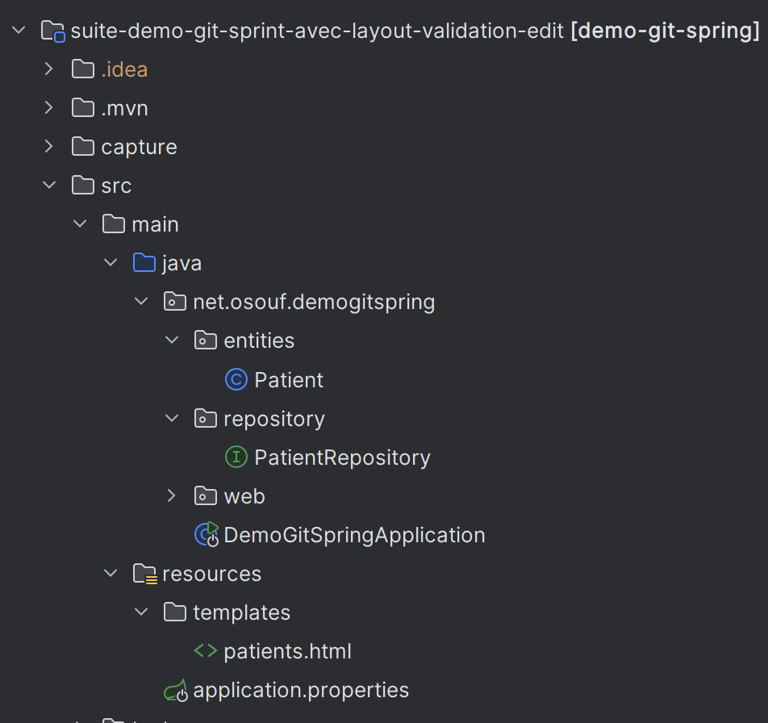

<h3>Suite demo-git-spring, demo second repository</h3>

Ici je reprends le repository de demo-git-spring, l'objectif est de le compléter 
avec, une page template layout, puis la création d'un formulaire pour éditer et mettre à jour des
patients, ensuite la valitation des fiches patients avec "Spring validation"

<h3>Demo premier repository</h3>

Une application avec une entity patient, une liste de patients 
qu'il est possible d'afficher, avec aussi la possibilité de 
supprimer ou de créer des patients 

